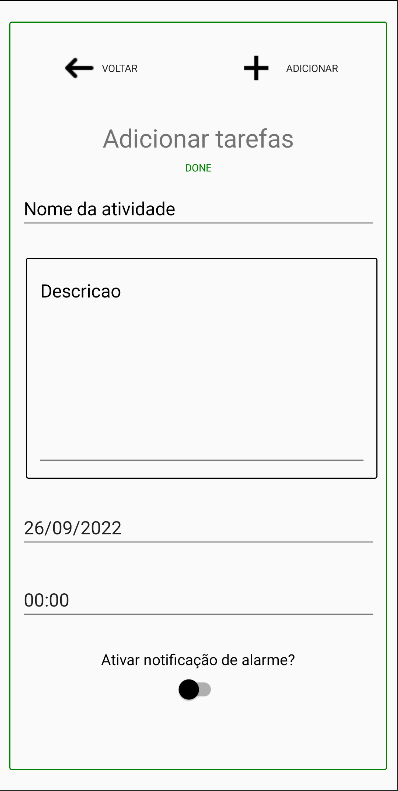
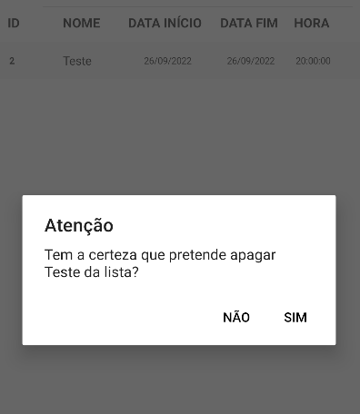

# GestorAtividades

Projeto Cláudio Correia - 2022
UFCD 5423 - FT1503 - Xamarin Forms

A aplicação permite ao utilizador adicionar atividades (3 tipos - DONE, TO DO ou DOING)
e estabelecer deadlines para as mesmas,assim que esses deadlines
esgotarem e não tiverem sido concluídas, o utilizador receberá uma notificação.

